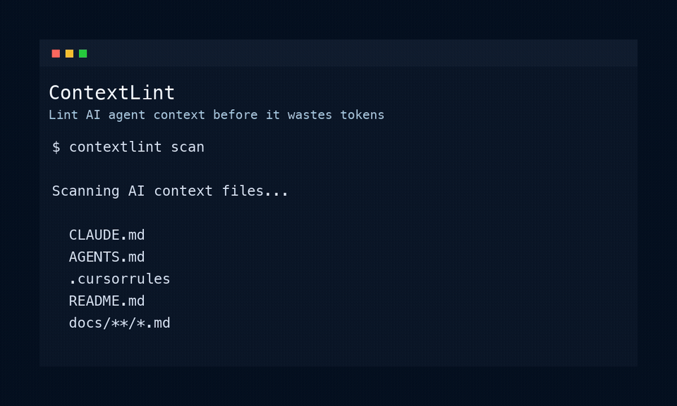

# ContextLint

Lint, score, and compress your AI agent context files.

ContextLint scans `CLAUDE.md`, `AGENTS.md`, `.cursorrules`, Cursor rules, `README.md`, `docs/**/*.md`, and GitHub Copilot instructions to find duplicate, outdated, risky, and token-wasting context before Claude, Cursor, Codex, Gemini, or another AI coding agent reads it.



## Status

Production-usable Rust CLI. Current focus: reliable local scanning, CI usage, and low-friction install.

Implemented:

- `contextlint scan`
- `contextlint scan --json`
- `contextlint scan --fail-under <score>`
- `contextlint report --format markdown`
- `contextlint report --format json`
- `contextlint init`
- `contextlint generate agents`
- `contextlint completions <shell>`
- GitHub Action via `uses: arsyadal/contextlint@v0.1.2`
- File discovery for common AI context files
- Approximate token estimation
- Duplicate instruction detection
- Noisy section detection
- Risky phrase detection
- Outdated note detection
- Missing backtick file reference detection
- Missing command/script detection
- Basic dependency/technology mismatch detection
- Inline and config ignore support

## Install

Via Homebrew:

```bash
brew tap arsyadal/tap
brew install contextlint
```

Via Cargo:

```bash
cargo install contextlint
```

Upgrade:

```bash
brew upgrade contextlint
# or
cargo install contextlint --force
```

## Install from source

```bash
cargo install --path .
```

## Usage

```bash
contextlint scan
contextlint scan --json
contextlint scan --path ./my-project --fail-under 70
contextlint report --format markdown --output contextlint-report.md
contextlint report --format json
contextlint init
contextlint completions bash > contextlint.bash
contextlint generate agents --output AGENTS.generated.md
```

Try demo fixture:

```bash
contextlint scan --path examples/fixtures/messy-context
```

More docs:

- [CLI reference](docs/cli.md)
- [Configuration](docs/config.md)

## GitHub Action

```yaml
name: ContextLint

on:
  pull_request:

jobs:
  contextlint:
    runs-on: ubuntu-latest
    steps:
      - uses: actions/checkout@v4
      - uses: arsyadal/contextlint@v0.1.2
        with:
          fail-under: "70"
```

## Default scanned files

```txt
CLAUDE.md
AGENTS.md
.cursorrules
.cursor/rules/*
README.md
docs/**/*.md
.github/copilot-instructions.md
```

## Config

Create config:

```bash
contextlint init
```

Example `.contextlintrc.json`:

```json
{
  "include": ["CLAUDE.md", "AGENTS.md", ".cursorrules", "README.md", "docs/**/*.md"],
  "exclude": ["node_modules/**", "dist/**", "build/**", "docs/archive/**"],
  "scoreThreshold": 70,
  "tokenEstimator": "approximate",
  "ignore": ["risky-instruction:docs/archive/**"],
  "rules": {
    "duplicateInstruction": true,
    "outdatedArchitecture": true,
    "riskyInstruction": true,
    "noisySection": true
  }
}
```

## Ignoring issues

Inline ignore:

```md
<!-- contextlint-ignore-next-line -->
Ignore tests during refactor.

Ignore tests during refactor. <!-- contextlint-ignore -->
```

Config ignore supports rule IDs, path globs, and `rule-id:path/glob/**`:

```json
{
  "ignore": [
    "duplicate-instruction",
    "docs/archive/**",
    "risky-instruction:docs/stale-context/**"
  ]
}
```

## Scoring

ContextLint starts at `100` and subtracts issue penalties:

```txt
critical = -20
high     = -12
medium   = -6
low      = -2
```

Score bands:

```txt
90–100 = Excellent
75–89  = Good
60–74  = Needs Cleanup
40–59  = Risky
0–39   = Very Noisy
```

## Development

```bash
cargo fmt --check
cargo check --locked
cargo clippy --locked -- -D warnings
cargo test --locked
cargo run -- scan
```

## Product principle

The best AI context is not the longest context. It is the clearest, safest, and most relevant context.
